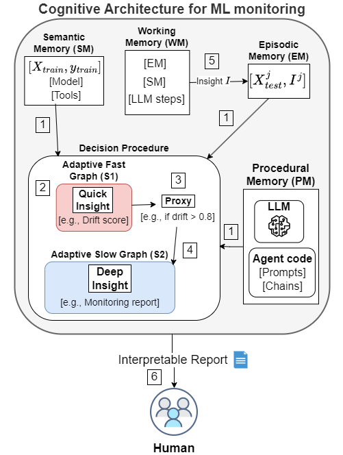
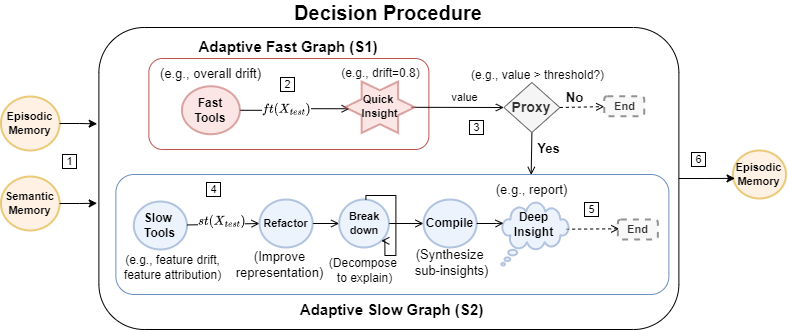

# Cognitive Architecture for ML Monitoring

This repository contains the implementation of a cognitive architecture for monitoring machine learning models. The architecture leverages semantic, episodic, procedural, and working memory to generate interpretable reports for model monitoring.

## Overview

Monitoring machine learning models in production is critical to ensure their performance and reliability. Traditional methods, like distribution drift detection and feature attribution, often require significant manual effort and technical expertise. This project introduces a novel adaptive cognitive architecture using large language models (LLMs) to improve the interpretation of monitoring outputs, generating actionable insights efficiently.

## Repository Structure

- **generate_dataset.ipynb**: Creates synthetic datasets designed to mimic real-world scenarios for drift distribution problems. It includes healthcare, eligibility, and financial datasets.
- **benchmark_dataset.ipynb**: Runs all methods to create reports that are tested for each dataset.
- **results.ipynb**: Contains the final plots and LaTeX tables with the results.
- **datasets/**: Contains artifacts for each dataset, including reports, prompts, answers, and descriptions.
- **cama/**: Core library implementing the cognitive architecture, including decision.py, insight.py, memory.py, and other necessary files.
- **requirements.txt**: Lists the Python dependencies required for this project.

## Usage

1. **Generating Datasets**:
    - Run `generate_dataset.ipynb` to create the synthetic datasets. This notebook generates features that mimic real-world data scenarios and stores them in the `datasets/` folder. In this case, it generated 3 datasets: healthcare, eligibility, and financial.

2. **Benchmarking**:
    - Execute `benchmark_healthcare.ipynb` to run all methods related to healthcare scenarios and generate reports on testing. This data has features like BMI and Blood Pressure to reflect rising obesity and hypertension rates.
    - Execute `benchmark_eligibility.ipynb` to run all methods related to eligibility scenarios and generate reports on testing. This data has attributes such as Income and Employment Status to simulate economic growth and changing employment patterns.
    - Execute `benchmark_financial.ipynb` to run all methods related to financial scenarios and generate reports on testing. This data has features like Credit Score and Loan Amount to reflect inflation, changes in borrowing behavior, and variations in the economic climate.

3. **Results Analysis**:
    - Use `results.ipynb` to visualize the results, including plots and LaTeX tables summarizing the final numbers.

## Cognitive Architecture

The architecture consists of several components:

- **Semantic Memory (SM)**: Stores generalized knowledge from training data, models, and tools.
- **Episodic Memory (EM)**: Retains specific past instances of model monitoring and the insights generated.
- **Procedural Memory (PM)**: Contains the agent code, including prompts and chains, necessary for LLM utilization.
- **Working Memory (WM)**: Holds the current context, integrating real-time data with insights from SM and EM.

### Decision Procedure

1. **Adaptive Fast Graph (S1)**:
    - Quickly generates insights (e.g., drift scores) using fast tools.
    - If significant drift is detected, transitions to S2.

2. **Adaptive Slow Graph (S2)**:
    - Performs a detailed analysis using slow tools.
    - Refines data representation, decomposes issues, and compiles insights into comprehensive reports.

### Flow of the Architecture

1. **Input Data**: The architecture processes input data (`X_test`) to generate initial insights.
2. **Quick Insight**: Fast tools provide quick insights such as drift scores.
3. **Proxy Decision**: A threshold-based decision determines if deeper analysis is needed.
4. **Deep Insight**: Detailed analysis using slow tools leads to comprehensive insights.
5. **Output**: Generates an interpretable report for human analysis.

## References

- Paper in revision.

