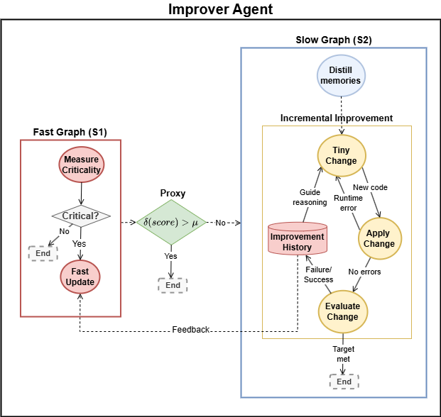

# KC-Agent: A Dual-Process Cognitive Architecture for ML Model Improvement

This repository implements KC-Agent (Kahneman-Clear Agent), a novel dual-process cognitive architecture for safe and efficient machine learning model improvement. The architecture leverages insights from cognitive science to balance fast pattern recognition with deliberate analytical reasoning when implementing model improvements.

## Overview

Maintaining and improving ML models in production environments is a critical challenge as data distributions evolve over time. Traditional approaches often require extensive manual intervention or risk catastrophic forgetting when implementing improvements. KC-Agent addresses these challenges through a cognitive architecture that integrates dual-process thinking with incremental improvement principles, enabling safer and more efficient model updates.

The architecture consists of two complementary systems:
- **Fast Graph (System 1)**: Rapidly identifies and applies pattern-based fixes for common model issues
- **Slow Graph (System 2)**: Implements careful, deliberate improvements through incremental modifications

This dual-process approach optimizes the trade-off between computational efficiency and improvement quality, with theoretical guarantees for monotonic improvement under specified conditions.



## Quickstart

```bash
git clone <repo>
cd improver
uv venv --python 3.11.5
uv pip install -e .
jupyter notebook results.ipynb   # view results and plots
```

## Repository Structure

```
caia/                    Core agent package
  fast/                  Fast Graph (System 1)
  slow/                  Slow Graph (System 2)
  benchmark/             Baseline agent implementations
datasets/                Synthetic datasets with distribution drift scenarios
experiments/             Active experiment notebooks (dev5_* per domain, data prep)
archive/                 Older experiment iterations (dev1-3, dev4_*)
results/                 Per-run experiment YAML files (named by agent/dataset/llm)
data/                    Committed result summaries, LLM evals, and human evaluation
paper_figures*/          Figures used in the research paper, per domain
results.ipynb            Main analysis notebook: load results and generate plots
```

### Metrics Files

Generated at runtime by executing experiments:
- `fast_graph_metrics.yaml`, `slow_graph_metrics.yaml`: Performance metrics for Fast and Slow graphs
- `old_metrics.yaml`, `new_metrics.yaml`: Performance on old and new data distributions

Committed result summaries:
- `summary_metrics_{domain}.yaml`: Aggregated per-domain results
- `llm_evals_{model}.yaml`: LLM judge evaluation scores
- `human_evaluation.yaml`: Human evaluation scores

## Usage

1. **Generating Datasets**: Run `experiments/generate_dataset.ipynb` to create synthetic datasets simulating distribution drift in different domains, then `experiments/split_datasets.ipynb` to prepare data for improvement experiments.

2. **Running Experiments**: For each domain, execute the corresponding notebook in `experiments/`, for example `experiments/dev5_financial.ipynb`. Each notebook implements the complete KC-Agent architecture with Fast and Slow graphs.

3. **Analyzing Results**: Use `results.ipynb` at the repo root to visualize performance metrics and generate comparison plots. Key metrics include accuracy on old/new data distributions, execution time, and token usage.

## Cognitive Architecture Components

### Dual-Process Framework

The core of KC-Agent is its dual-process architecture:

1. **Fast Graph (System 1)**:
   - Implements pattern-based model retraining using combined old and new data
   - Evaluates performance improvements through a proxy mechanism
   - Terminates if sufficient improvement is achieved, otherwise proceeds to System 2

2. **Slow Graph (System 2)**:
   - Performs memory distillation to identify model limitations and potential improvements
   - Analyzes improvement strategies: model selection, hyperparameter tuning, ensembling
   - Implements tiny, verifiable changes with theoretical guarantees
   - Evaluates changes across both distributions to ensure balanced improvement

### Memory Components

The architecture utilizes three memory types:
- **Semantic Memory**: Stores dataset descriptions, model architectures, and general knowledge
- **Episodic Memory**: Records specific improvement attempts and their outcomes
- **Working Memory**: Maintains current state during the improvement process

## Theoretical Guarantees

KC-Agent provides theoretical guarantees for monotonic improvement under the following conditions:
1. Each change satisfies complexity constraints (tiny, verifiable modifications)
2. The LLM knowledge function is consistent
3. The evaluation environment remains stationary during improvement

Under these conditions, KC-Agent guarantees that with high probability, the final model's performance will be at least as good as the initial model, plus the sum of all positive improvements, minus a small error term.

## Benchmarks

The repository includes comprehensive benchmarks comparing KC-Agent against several baselines:
- Plan and Execute
- ReAct
- Reflexion
- Self-Discovery
- Tree of Thoughts
- CodeAct

Evaluation metrics include:
- Accuracy on original data distribution
- Accuracy on new data distribution
- Execution time
- Token consumption

Results demonstrate that KC-Agent significantly outperforms baseline methods, achieving superior accuracy on both old and new distributions while consuming fewer computational resources.

## References

- Paper accepted at COMPSAC 2026.
- This work is part of a larger research framework for intelligent ML model adaptation.

## Requirements

See `pyproject.toml` for a complete list of dependencies. Key packages include:
- LangGraph
- LangChain
- pyautogen
- scikit-learn
- pandas
- matplotlib, seaborn
- pyyaml
